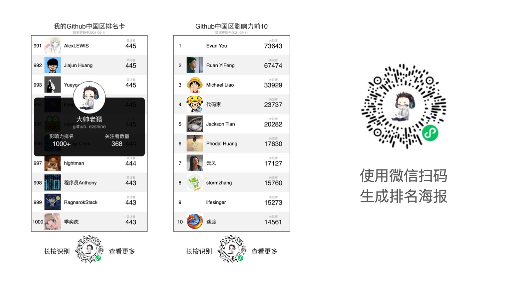

# Github中国区排名历史

> 通过Github Action每天会自动搜索 Github 中 Location 字段里包含 China 的前1000名用户，并生成json数据文件。

  

## 使用说明

### 直接使用

直接使用  json 文件，用于做一些本地数据分析，或者通过URL直接读取json静态文件，如果你所在的地方没有GFW的话。

### 推送到自己的接口

1. fork本仓库
2. 进入github的设置，生成PAT，在 secrets 中填入 MYTOKEN
3. 你需要有一个接口URL，在 secrets 中填入 POSTURL，CI爬取到数据生成JSON文件前会通过POST 提交 给接口。入参如下：

~~~
record_date:data.record_date,//记录日期
total_users:data.total_users,//当日中国区总计人数
rank_list:data.rank_list//1000条排名数据
~~~

# **Enjoy！**

觉得不错的小伙伴记得follow我哟 ，我也想冲排名~
